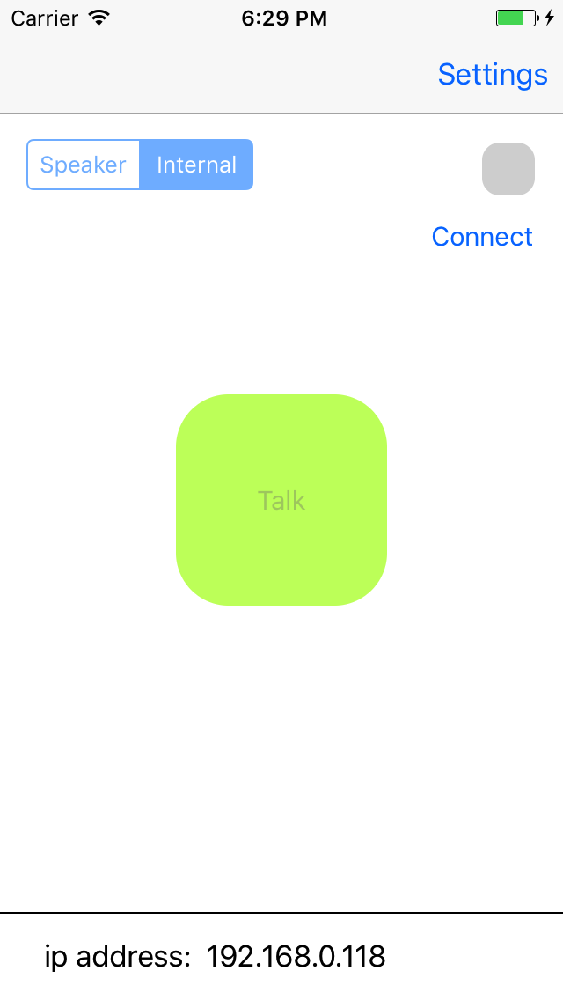
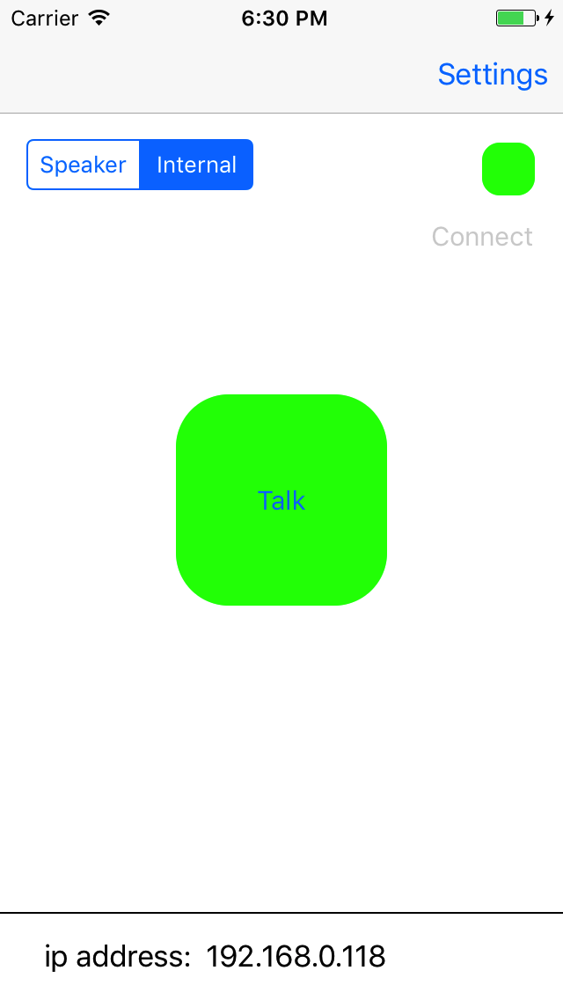
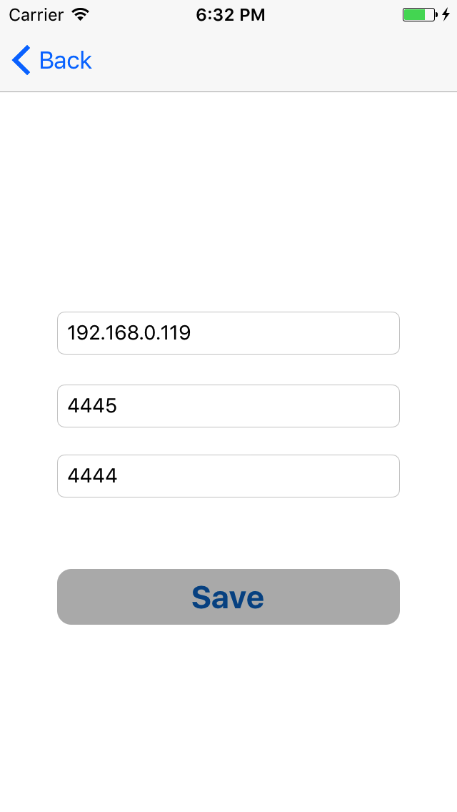

# WalkieTalkie

The main idea of the project was to implement a walkie-takie iOS app, that would operate within a local network via UDP in a one-to-one manner. 
All UDP operations are implemented by means of [CocoaAsyncSocket](https://github.com/robbiehanson/CocoaAsyncSocket) library. 

So far the app has two pages: 
- the main view containig the connect and talk button and where the most of the user interaction would be performed; 
- the Settings view, where the connection parameters (local & remote ports and opponent address) should be entered prior to connecting.

Main View (not connected) | Main View (connected) | Settings  
:-------------------------:|:-------------------------:|:-------------------------:
  |   |  

### Installation

In order to run the project the dependencies should be installed first. To do this simply navigate to the project directory and run `pod install`.
If you don't have [cocoapods](https://cocoapods.org) installed already, then [here's](https://guides.cocoapods.org/using/getting-started.html) how it can be done.
